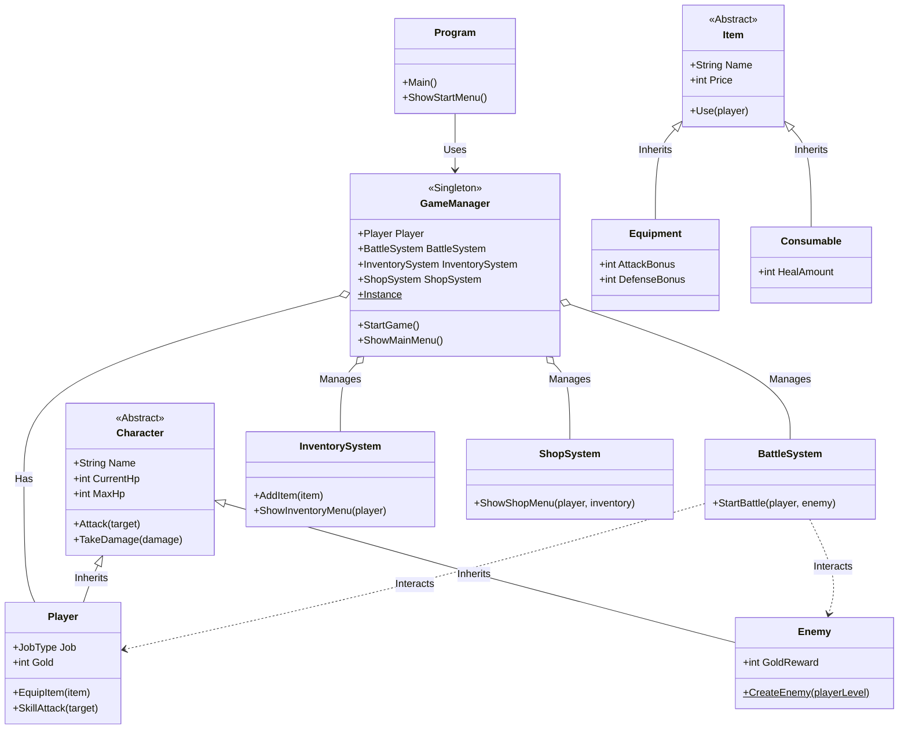
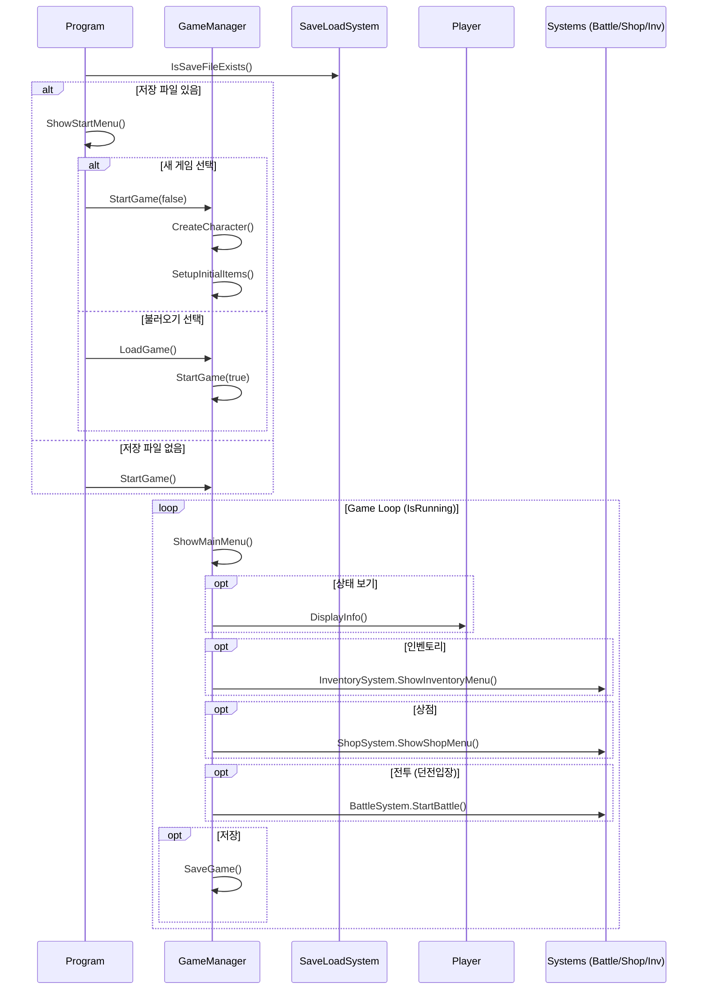

# BSsenTextRPG Project Structure & Flow

이 문서는 **BSsenTextRPG** 프로젝트의 클래스 구조와 게임 실행 흐름을 시각화하여 설명합니다.

## 1. Class Structure (클래스 다이어그램)

프로젝트는 **Singleton** 패턴을 사용하는 `GameManager`를 중심으로 시스템과 모델이 연결되어 있습니다. 캐릭터와 아이템은 추상 클래스를 통한 상속 구조를 가집니다.

---

## 2. Game Flow (시퀀스/플로우 다이어그램)

전반적인 게임의 초기화 및 메인 루프 실행 흐름입니다.

## 3. 주요 구성 요소 설명

| 구성 요소 | 설명 |
| :--- | :--- |
| **GameManager** | 전체 게임의 상태와 시스템을 관리하는 중앙 컨트롤러입니다. |
| **Models** | 플레이어, 적, 아이템 등 게임 내 데이터 객체들을 정의합니다. |
| **Systems** | 전투, 인벤토리, 상점, 저장/로드 등 게임의 핵심 로직을 담당합니다. |
| **Utils** | UI 출력부(`ConsoleUI`) 등 공통 유틸리티 기능을 제공합니다. |
